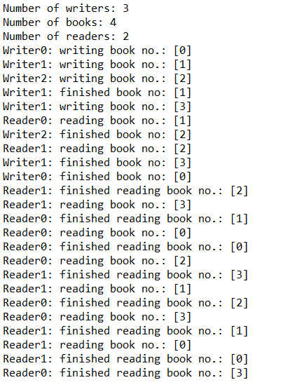

# multithread_writers_readers
 Simple writers/readers (producers/consumers) program using multithreading in java

## Rules
Eeach writer can write only one book at a time. Each book can be written by only one author. Each book can be read by only one reader at a time. Program finishes when every reader finishes all of the books. 

## Results

